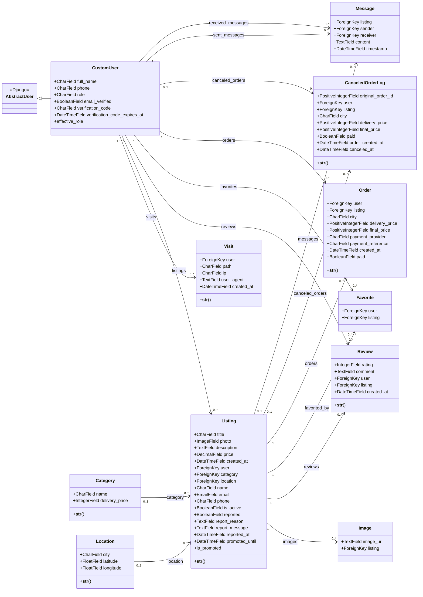

# Class Diagram

Нижче наведена діаграма основних доменних класів Django-проєкту: користувачі, оголошення, замовлення, чат і пов'язані сутності.

## Programmatic Version

Якщо потрібна не Mermaid-діаграма, а програмно згенероване зображення, використовуйте:

- `docs/generate_class_diagram.py`: Python-генератор SVG-діаграми.
- `docs/class_diagram.svg`: готова векторна діаграма класів.

Щоб перегенерувати файл:

```bash
python docs/generate_class_diagram.py
```



## Source Files

- `users/models.py`: `CustomUser`, `Visit`
- `listings/models.py`: `Category`, `Location`, `Listing`, `Image`, `Review`, `Favorite`
- `orders/models.py`: `Order`, `CanceledOrderLog`
- `chat/models.py`: `Message`
